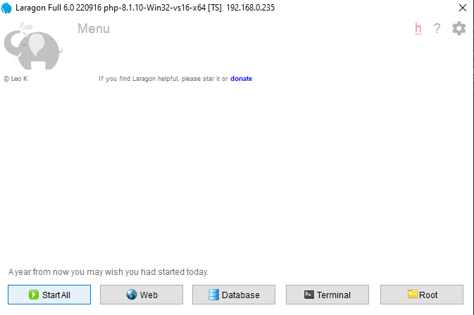

# Soft-BD-LTD-Hire-Train-Program

Php Laravel new Project Set up:

Download and Install
- Laragon               : https://getcomposer.org/Composer-Setup.exe
- Composer              : https://github.com/leokhoa/laragon/releases/download/6.0.0/laragon-wamp.exe
- Node JS for frontend  : https://nodejs.org/dist/v22.4.0/node-v22.4.0-x64.msi

After Installing Laragon 
1. Start the Server -> Menu -> tool ->Quick Add ->*phpmyadmin
2. Start the Server -> Database -> phpMyAdmin

<<<<<<< HEAD

=======

>>>>>>> 6ddc0b058d0c967377168d37c62e4fa524f1b05e

