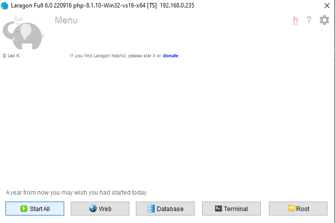
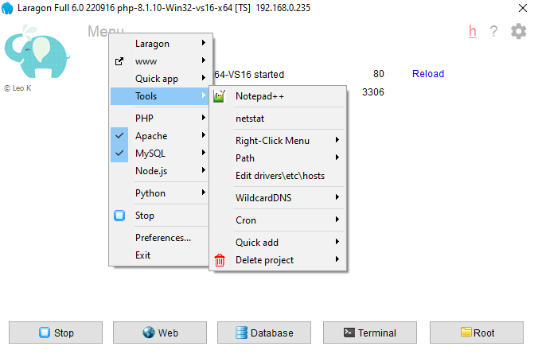
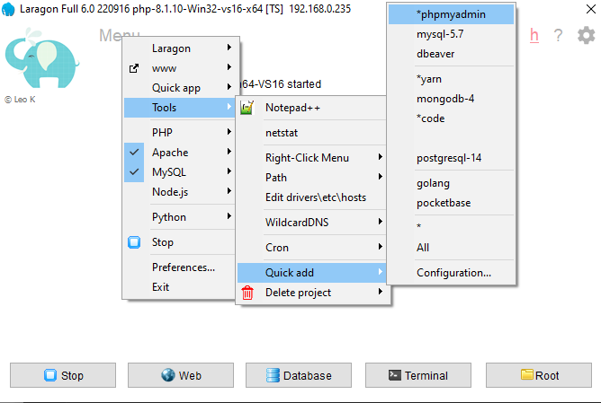
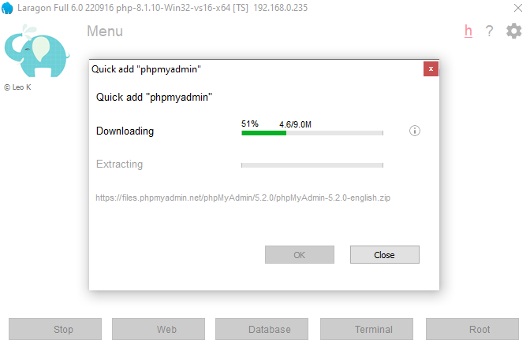
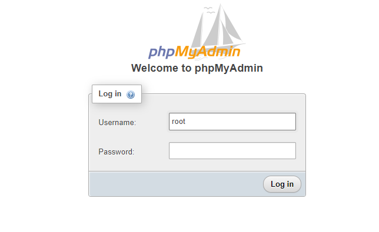

# Soft-BD-LTD-Hire-Train-Program

Php Laravel new Project Set up:

Download and Install
- Laragon               : https://getcomposer.org/Composer-Setup.exe
- Composer              : https://github.com/leokhoa/laragon/releases/download/6.0.0/laragon-wamp.exe
- Node JS for frontend  : https://nodejs.org/dist/v22.4.0/node-v22.4.0-x64.msi

## After Installing Laragon 
1. Start the Server -> Menu -> tool ->Quick Add ->*phpmyadmin
2. Start the Server -> Database -> phpMyAdmin

<table>
    <tr>
        <td>  </td>
        <td>  </td>
    </tr>
    <tr>
        <td>  </td>
        <td>  </td>
    </tr>
    <tr>
        <td>  </td>
    </tr>

</table>


## Go to the folder on which you want to create a new project

1. Open CMD in the folder
2. Write the command to create a new project

```bash
composer create-project laravel/laravel example-app

